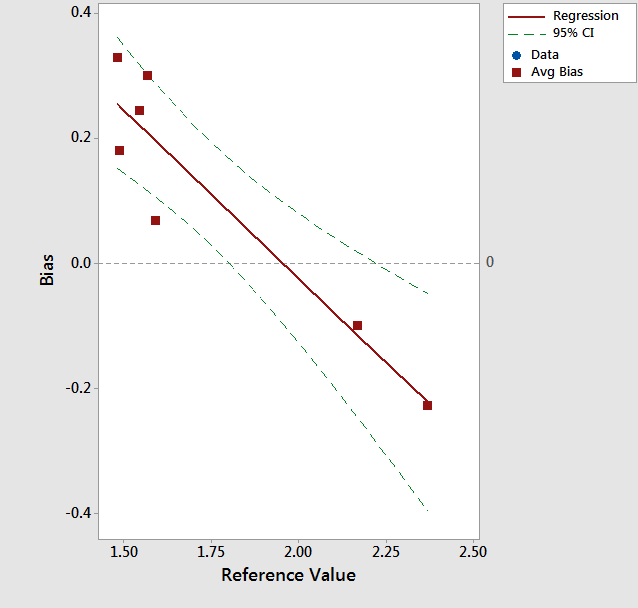
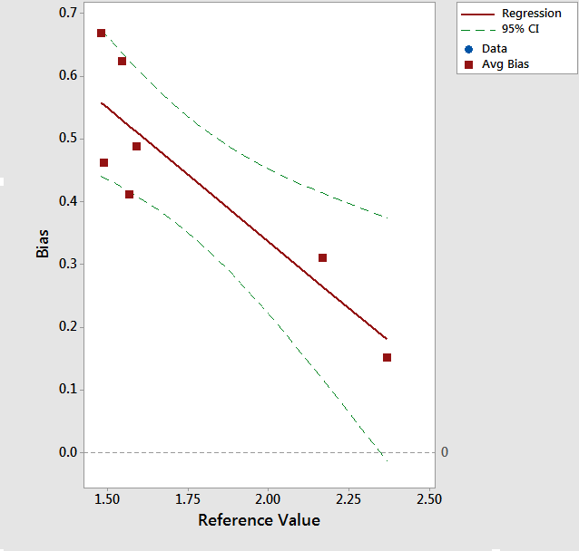

<style>
body {
text-align: justify}
</style>
```{r setup, include=FALSE}
knitr::opts_chunk$set(echo = TRUE)
```

## Introduction

## Data

The original data set looked like...
```{r Table 1: Summary, message = FALSE}
rm(list = ls())

library(knitr)
library(kableExtra)

df <- read.csv(file = "dummydata.csv")
df <- df[ , -c(5:7)]
colnames(df)[1:4] <- c("sample", "ref", "m1", "m2")
df$bias1 <- df$m1 - df$ref
df$bias2 <- df$m2 - df$ref

rownames(df) <- df$sample
df <- df[ , -1]

df %>%
  kable(align = "l") %>%
  kable_styling(bootstrap_options = c("striped", "hover", "condensed"),
                full_width = TRUE, font_size = 12, position = "center") %>% 
  scroll_box(width = "100%", height = "350px")
```

Cleaned the data and then...

```{r  Table 2: Clean Summary, message = FALSE}
df[5:7, c(1, 4, 5)] <- NA
df %>%
  kable(align = "l") %>%
  kable_styling(bootstrap_options = c("striped", "hover", "condensed"),
                full_width = TRUE, font_size = 12, position = "center") %>% 
  scroll_box(width = "100%", height = "350px")
```

Ran the m1 vs. ref...
```{r Table 3: Machine 1, message = FALSE}
attach(df)

m1.model <- lm(m1 ~ ref)
summary(m1.model)
```

Ran the m2 vs. ref...

```{r Table 4: Machine 2, message = FALSE}
m2.model <- lm(m2 ~ ref)
summary(m2.model)
```


Ran the bias1...

```{r Table 5: Bias 1, message = FALSE}
b1.model <- lm(bias1 ~ ref)
summary(b1.model)
```

<center>
```{r Fig 1. Bias 1, echo = FALSE, fig.cap = "Bias and Linearity for Machine 1", out.width = '89%'}

```
</center>

Ran the bias2...

```{r Table 6: Bias 2, message = FALSE}
b2.model <- lm(bias2 ~ ref)
summary(b2.model)
```

<center>
```{r Fig 2. Bias 2, echo = FALSE, fig.cap = "Bias and Linearity for Machine 2", out.width = '80%'}

```
</center>

## Results and Discussion

#### Other Predictor Combinations, Transformations

## Conclusions

## Appendix I: R Code
